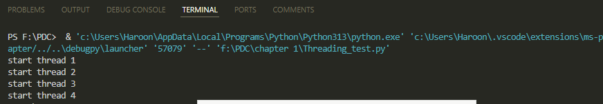

# Chapter 1:
### Topics Covered:

# README

## Overview

This repository contains Python scripts demonstrating various parallel and concurrent programming techniques, including multiprocessing, threading, message passing, semaphores, and task parallelism.

---

## Files and Descriptions

### **1. `Data Parallelism.py`**
- Demonstrates data parallelism using NumPy for fast array operations.
- **Key Operations:**
  - Generates two large random arrays.
  - Computes their sum in parallel using NumPy.
- **Output:**
  - Time taken for computation.
  - First 10 elements of the resulting array.

---

### **2. `Do_something.py`**
- Contains the `do_something` function for generating random numbers.
- **Key Functionality:**
  - Appends `count` random numbers to a given list.

---

### **3. `Message Passing.py`**
- Illustrates message passing using the `mpi4py` library.
- **Key Features:**
  - Sends and receives data between processes.
  - Requires at least two processes to run.
- **Behavior:**
  - Process 0 sends data to Process 1.
  - Process 1 receives the data.

---

### **4. `Multiprocessing_test.py`**
- Compares the performance of multiprocessing and multithreading.
- **Key Components:**
  - Uses `multiprocessing` to spawn multiple processes.
  - Uses `threading` to create multiple threads.
- **Output:**
  - Execution time for multiprocessing.
  - Execution time for multithreading.

---

### **5. `Process_Creation.py`**
- Demonstrates the creation of processes using the `multiprocessing` module.
- **Key Functionality:**
  - Creates two processes:
    - One to calculate the square of a number.
    - Another to calculate the cube.
- **Output:**
  - Square and cube of the given number.

---

### **6. `Semaphore.py`**
- Implements thread synchronization using a semaphore.
- **Key Features:**
  - Restricts access to a shared resource to one thread at a time.
- **Behavior:**
  - Each thread accesses a resource for 2 seconds before releasing it.
  - Output indicates which thread is accessing the resource.

---

### **7. `Serial and parallelprogramming.py`**
- Shows simple parallel programming using `ThreadPoolExecutor`.
- **Key Functionality:**
  - Executes two tasks (`task_1` and `task_2`) concurrently.

---

### **8. `Task_parallelism.py`**
- Demonstrates task parallelism using `ThreadPoolExecutor`.
- **Key Features:**
  - Executes two mathematical tasks (addition and subtraction) in parallel.
- **Output:**
  - Results of the tasks.
  - Total execution time.

---

### **9. `Threading_test.py`**
- Explores multithreading by calculating Fibonacci numbers.
- **Key Features:**
  - Creates 4 threads to compute the 30th Fibonacci number concurrently.
- **Output:**

---

